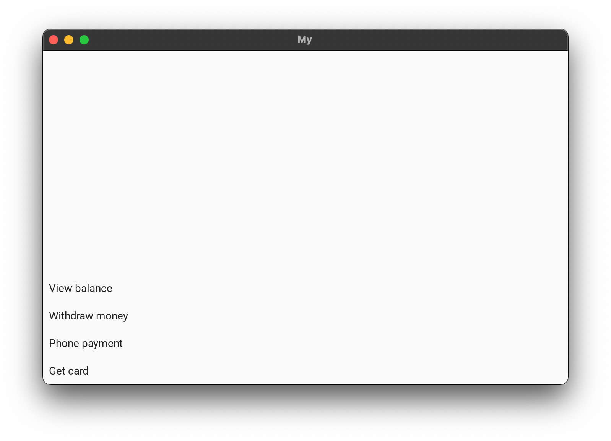
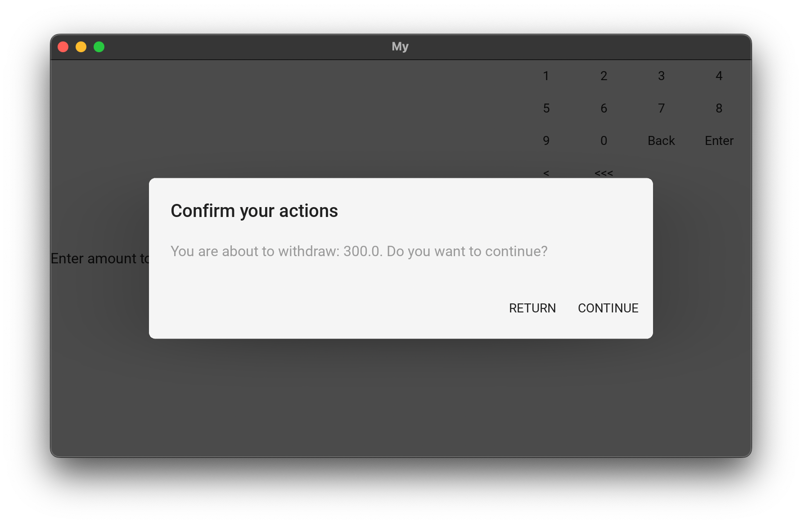
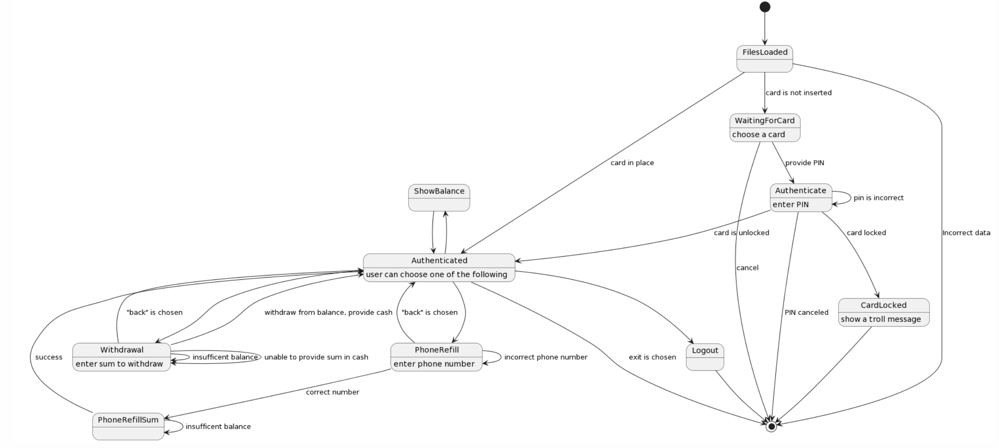
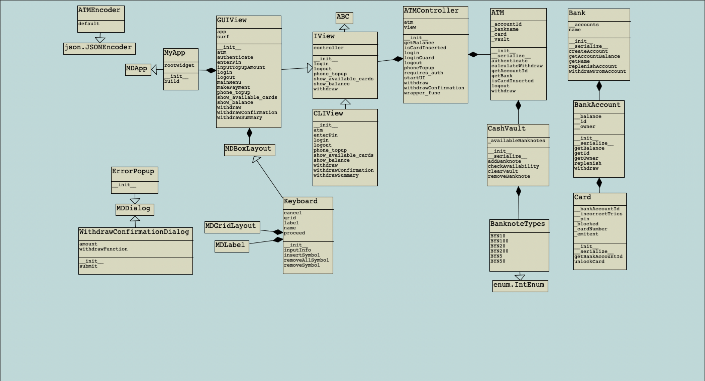

# ATMSimulator
## What
This is an interesting assignment I had to do in my university. The task was, briefly, as follows: create an ATM simulator with CLI interface, and then refactor it using MVC pattern. Add a GUI layer. Architecture should have as much shared code as possible
## How to run
- Use `python3 main.py` for info on the CLI mode
- To launch GUI, run `python3 main.py gui`

## Preview
CLI mode:

GUI (main menu):

GUI (withdraw dialog):

## Design decisions
I went with a passive-model MVC pattern. I felt like MVP might be a better fit in this project, but after trying it a bit I've realized it becomes too verbose, quickly. I didn't like the code I've got in the end of that experiement.

There's an IView, so interface and the controller are not tightly coupled, precisely because I have 2 view implementations (and I've had a TUI, too, because I didn't read the assignment careful enough...)

Everything else is more or less standard. You can check the exact details by reading the code, the data dump (`backup.json`) and the diagrams:

State diagram:

Class diagram
